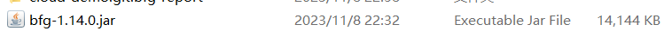
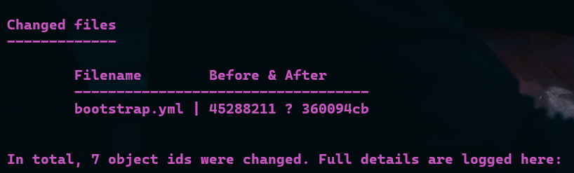

# 清楚git提交的历史纪录，或者删除

这个很有用处，因为如果不小心提交了某些密钥等关键数据可以用这个来清理这些安全隐患数据。

## 下载

[下载地址](https://repo1.maven.org/maven2/com/madgag/bfg/1.14.0/bfg-1.14.0.jar)

将下载后的压缩包解压即可



得到一个jar包


## 使用方法

### 1-清除数据

#### --mirror clone repo

首先需要先以--mirror的方式clone仓库下来

```shell
git clone --mirror xx.git
```

#### 建立替换文件

```txt
# Replace with ‘***REMOVED***’ (default)

#oss:
#  endpoint: xxxxx
#  access_key_id: xxxx
#  access_key_secret: xxxx
```

这里的意思市使用‘***REMOVED***’替换下列文本信息

也有其他方法比如：

```txt
# replace with 'examplePass' instead
#myPwd123==>examplePass
```

使用指定字符串替换

```txt
#replace with the empty string
#myPwd123==> 
```

替换为空

#### 执行命令

```bash
java -jar bfg解压的jar包路径 --replace-text replacements.txt xx.git
```

执行后会有类似的展示：



#### push到仓库

```bash
cd xx.git
 
git reflog expire --expire=now --all 
 
git gc --prune=now --aggressive
 
git push
```

操作后所有的仓库分支都会修改